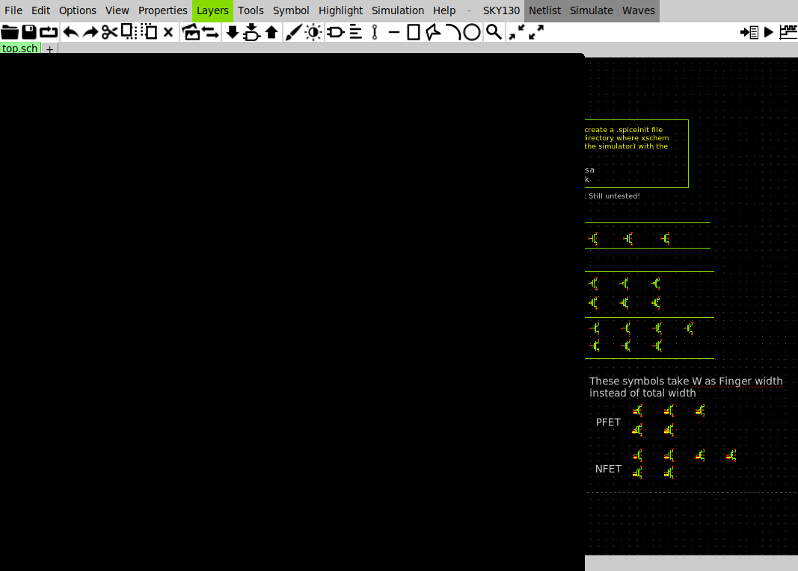
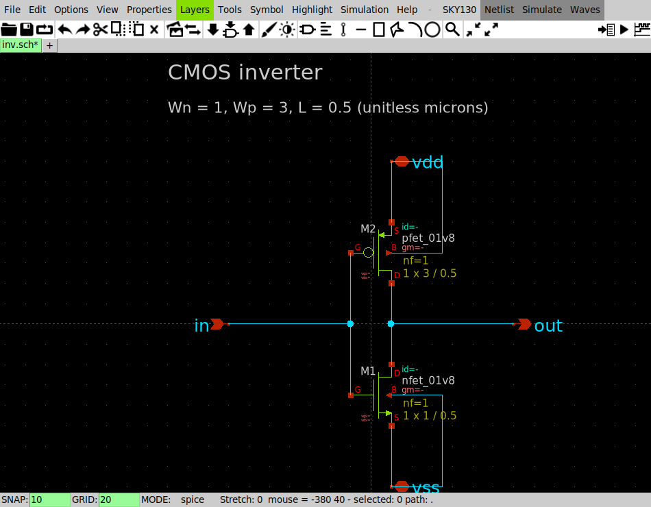
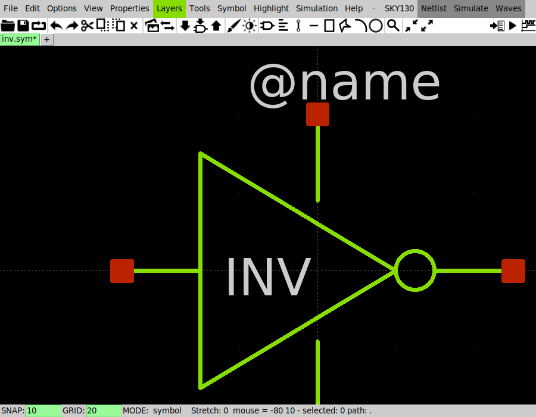
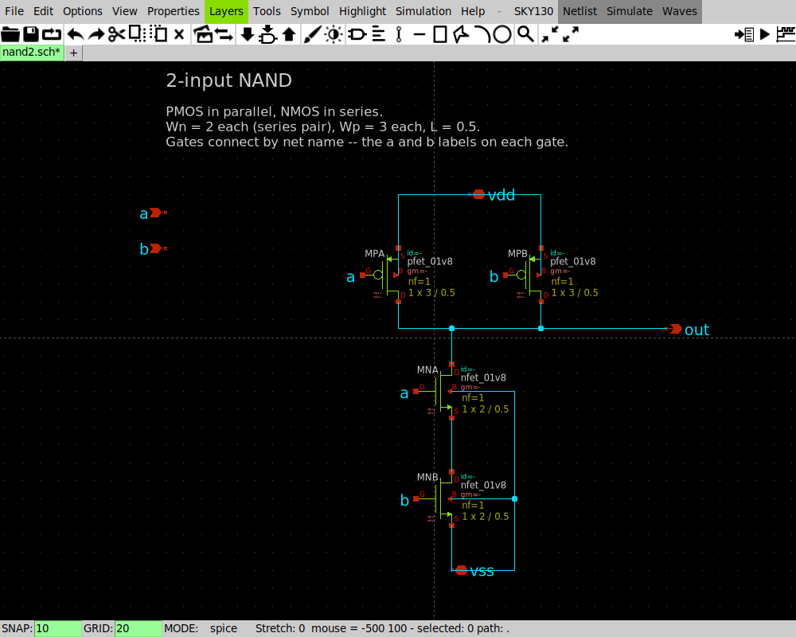
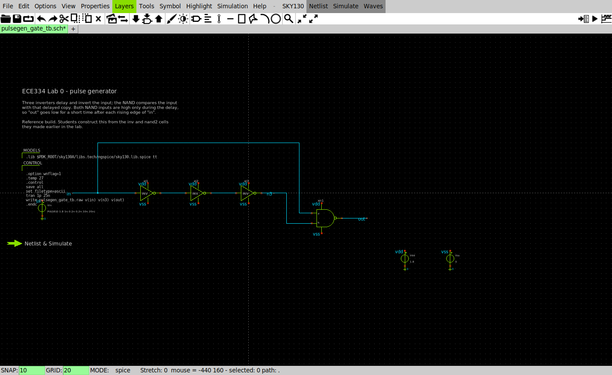
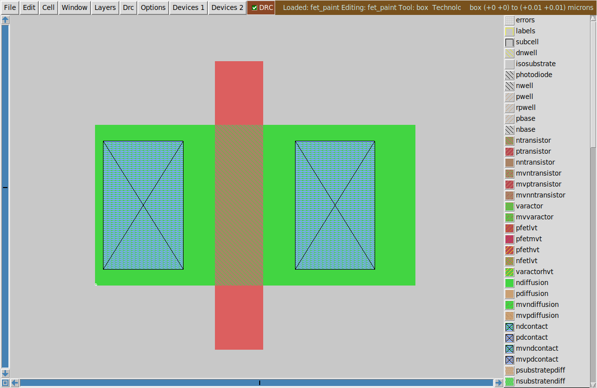

# Lab 0 — Introduction to XSchem and Magic

*ECE334 — Digital Electronics — SKY130 open-source flow*

## Objective

Get the toolchain working and build something with it. There are no marks for
this lab. Do it anyway: every later lab assumes you can place a symbol, wire a
schematic, run a simulation, and open a layout without being told how.

By the end you will have:

1. drawn a CMOS inverter from individual transistors and simulated it;
2. turned it into a reusable symbol, and built a 2-input NAND the same way;
3. wired both into a pulse generator and seen what it does;
4. painted a transistor in Magic; and
5. worked through `lab0.ipynb`, which is where you learn the notebook that
   Labs 1 to 4 are reported in.

Keep the [XSchem](../../reference/xschem-cheatsheet.md) and
[Magic](../../reference/magic-cheatsheet.md) cheatsheets open in another tab.

## The tools

| File | Purpose |
|------|---------|
| `lab0.ipynb` | The notebook tutorial. Self-contained: it runs against a deck that ships with the lab, so it works before your schematic does. |
| `spice/inv_demo.spice` | A CMOS inverter as a plain deck. Read it — every testbench in this course has the same five parts. |
| `xschem/`, `magic/` | Empty. This is the lab where you fill them. |

## Course conventions

--8<-- "includes/conventions.md"

## Preparation

Set up the environment first — see [Getting started](../../getting-started/index.md).
Then, in the desktop terminal:

```bash
. /foss/designs/common/.designinit
/foss/designs/scripts/smoke_test.sh
cd /foss/designs/lab0_setup
```

`.designinit` loads the SKY130 technology and installs the course XSchem
configuration. Source it once per terminal. If a tool behaves oddly later, run
it again — it is idempotent and fixes most configuration problems.

Work in `lab0_setup`. That folder is mounted from your own clone, so anything
you save there survives restarting the container.

**Watch the terminal you launched from.** XSchem and Magic print their warnings
and errors there, not in the GUI.

---

## L1 — XSchem

### L1.1 Getting around

```bash
xschem &
```


*Menu bar, toolbar, and drawing canvas. Messages appear at the bottom and in the
terminal.*

| Action | Key |
|--------|-----|
| Zoom to fit | `f` |
| Zoom in / out | `Shift-Z` / `Ctrl-Z`, or scroll |
| Pan | hold `Space` and drag |
| Keybinding overlay | `?` |
| Abort whatever you started | `Ctrl-C` |

Spend a minute panning and zooming an empty canvas before placing anything.

### L1.2 Placing transistors

Press `Shift-I` to open the symbol browser, or use **Tools → Insert symbol**.
Navigate to the SKY130 device library and place:

- `sky130_fd_pr/nfet_01v8.sym`
- `sky130_fd_pr/pfet_01v8.sym`

Select each device and press `q` to edit its properties.


*Set `W` and `L` only. `spiceprefix`, `nf` and the diffusion geometry come from
the symbol.*

Set `W=1 L=0.5` on the NMOS and `W=3 L=0.5` on the PMOS.

!!! warning "No `u` on W or L"
    `W=1`, not `W=1u`. The SKY130 models are binned on plain micron numbers. A
    value in metres falls outside every bin and ngspice stops with *"could not
    find a valid modelname"*. Expect to hit this at least once.

### L1.3 Wiring the inverter

Press `w` to draw wires. Click to start and to turn a corner; middle-click to
finish. Connect:

- PMOS: source to `vdd`, drain to `out`, gate to `in`, body to `vdd`
- NMOS: source to `vss`, drain to `out`, gate to `in`, body to `vss`

Add ports from the `devices` library: `ipin` for `in`, `opin` for `out`, and
`iopin` for `vdd` and `vss`.


*The finished cell. The device symbols are drawn source-outward, so the PMOS
source already faces `vdd` with no flipping.*

A hollow square on a port means it is **not** connected. Crossing wires do not
connect; only a wire endpoint landing on another wire or a port does. Zoom in
and check every square before moving on.

Save with `Ctrl-S` as `inv.sch`.

### L1.4 Making a symbol

**View → Make symbol** (`Shift-C`) generates a symbol from the ports, then `c`
swaps between the schematic and symbol views.


*Symbol view. Red squares are the pins. `@name` is substituted with each
instance's name when the symbol is placed.*

This is what hierarchy means here: `inv.sym` is now a part you can place in
another schematic, and XSchem pulls in `inv.sch` when it netlists.

Compare yours against `common/xschem/inv.sym`, which the later labs use.

### L1.5 A 2-input NAND

Build `nand2.sch` the same way: two PMOS in parallel from `vdd` to `out`, two
NMOS in series from `out` to `vss`. Use `W=2` for the series NMOS pair and
`W=3` for the PMOS.


*Parallel PMOS on top, series NMOS below. Gates connect by net name — the `a`
and `b` labels — which keeps the drawing readable.*

The series pair is doubled in width because two devices in series behave like
one device of half the width. Convince yourself of that before Lab 3, where you
size a more complicated gate the same way.

Make a symbol for it too.

### L1.6 A pulse generator

Now use both cells. Wire three inverters in a chain, feed the chain output to
one NAND input and the original signal to the other, and drive the whole thing
with a `pulse` source.


*Three `inv` instances and one `nand2`, with the input tapped along the top to
the NAND's other pin. Supplies connect by name through `vdd` and `vss` labels.*

Add a `code_shown` block with the model include and a `.control` block, then
click **Netlist** then **Simulate** in the menubar:

```
.control
save all
set filetype=ascii
tran 1p 25n
write pulsegen.raw v(in) v(n3) v(out)
.endc
```

Select a wire and press `p` to plot it.


*Each rising edge of `in` produces one short low-going pulse on `out`.*

Look at what happened. `in` goes high. The chain output `n3` stays high for a
while, because each inverter takes time to switch. During that window both NAND
inputs are high, so `out` goes low. When `n3` finally falls, `out` returns high.

The pulse is therefore as wide as the inverter chain is slow. **You are not
asked to predict that width here** — Lab 1 builds the model for it, starting
from an RC circuit and ending at exactly this measurement. For now, note the
width you observe, and note that it changes if you change the number of
inverters.

---

## L2 — Magic

Layout is where the circuit becomes geometry. Lab 2 does a full cell; here you
only draw one transistor.

```bash
cd /foss/designs/lab0_setup/magic
echo "source \$PDK_ROOT/sky130A/libs.tech/magic/sky130A.magicrc" > .magicrc
magic -d X11 -T sky130A fet &
```

Magic opens a layout window and a **tkcon** console. Commands go in tkcon.

### L2.1 The box

Magic acts on **the box**, a rectangle you position first. Left-click one
corner, right-click the other. Or set it exactly:

```
box 0um 0um 2um 1um
```

### L2.2 Painting a transistor

Paint a strip of diffusion, then cross it with poly:

```
box 0um 0um 2um 1um
paint ndiffusion
box 0.75um -0.4um 1.05um 1.4um
paint poly
```

Add a contact at each end so the source and drain can be wired:

```
box 0.05um 0.1um 0.55um 0.9um
paint ndcontact
box 1.25um 0.1um 1.75um 0.9um
paint ndcontact
```

Press `v` to fit the view.


*Green `ndiffusion` crossed by red `poly`, with a diffusion contact at each end.
The layer palette is on the right; the DRC status is in the toolbar.*

You never placed a transistor. Magic infers one from the overlap: poly over
diffusion **is** a gate, and the diffusion either side becomes source and drain.
Check it:

```
box 0.9um 0.5um 0.9um 0.5um
what
```

### L2.3 Design rules

Magic checks design rules continuously. Violations appear as white dots and a
count in the toolbar. Try it: move the poly to within a hair of a contact and
watch the dots appear.

```
drc check
drc count
drc why
```

`drc why` names the rule that was broken, which is faster than guessing. Get
back to zero before you finish.

Save with `Ctrl-S`.

---

## L3 — The notebook

Labs 1 to 4 are reported through a Jupyter notebook, and none of them stop to
explain it. This is where you learn it, with a demonstrator in the room.

```bash
. /foss/designs/common/.designinit
cd /foss/designs/lab0_setup
jlab
```

Open `lab0.ipynb` and work through it. It covers running a cell, why order
matters, loading a simulation result, measuring it, plotting it, and the
hand-analysis → measurement → written-answer shape every later section uses. It
also makes you cause a few of the common errors on purpose, so you recognise
them later.

Finish with **Kernel → Restart Kernel and Run All Cells**. That habit is worth
forming now: it is the only way to know your notebook runs top to bottom on
someone else's machine, which is how it will be marked.

---

## Expected results

Nothing is submitted. Before Lab 1, confirm you can:

- [ ] place a transistor and set `W` and `L` without the `u` error;
- [ ] wire a schematic with no unconnected ports left;
- [ ] make a symbol and instantiate it in another schematic;
- [ ] run a simulation and plot a net;
- [ ] paint geometry in Magic and reach `drc count` = 0; and
- [ ] run `lab0.ipynb` end to end from a restarted kernel with no errors.

## Extra notes

- `.designinit` is idempotent. Re-run it whenever something stops resolving.
- XSchem writes results to `/foss/designs/.xschem/simulations`.
- Keys that differ from most editors: in XSchem `c` copies and `q` opens
  properties; in Magic `d` deletes and `s` selects.
- Names are one flat namespace across labs. If you invent a cell name that a
  later lab also uses, one will shadow the other. Prefix yours if unsure.

## FAQ

**The symbol browser opens in the wrong folder.**
Click **Home** to return to the top of the tree, then navigate again.

**I placed a transistor but the netlist has no devices.**
Either the DUT or schematic was never saved, or XSchem cannot resolve the
symbol. Re-run `.designinit` and reopen.

**Magic says `Failed to load technology`.**
No `.magicrc` in the directory you started from. Create it as shown above.

**My layout window is blank except for one labelled rectangle.**
That is an unexpanded subcell. Press `x`.
