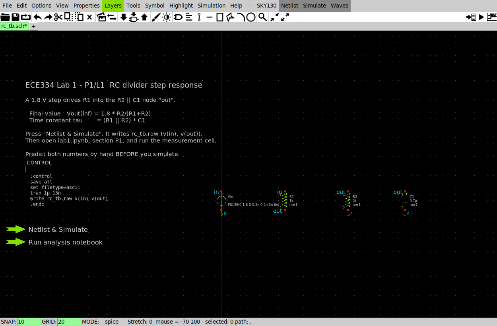
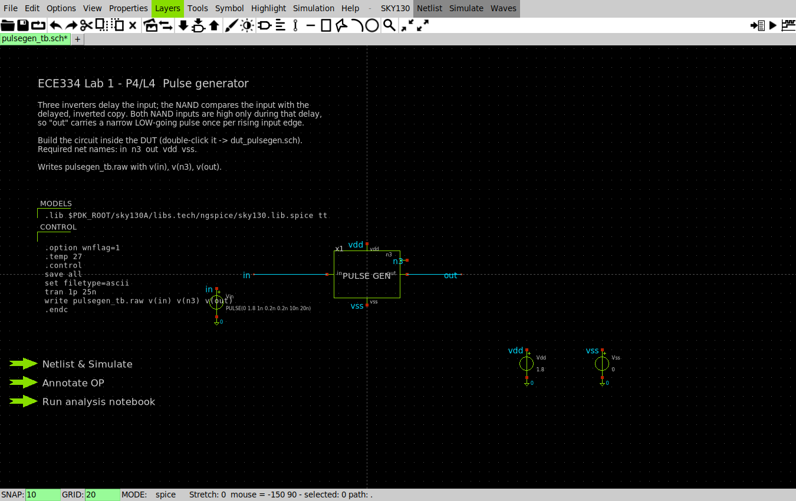
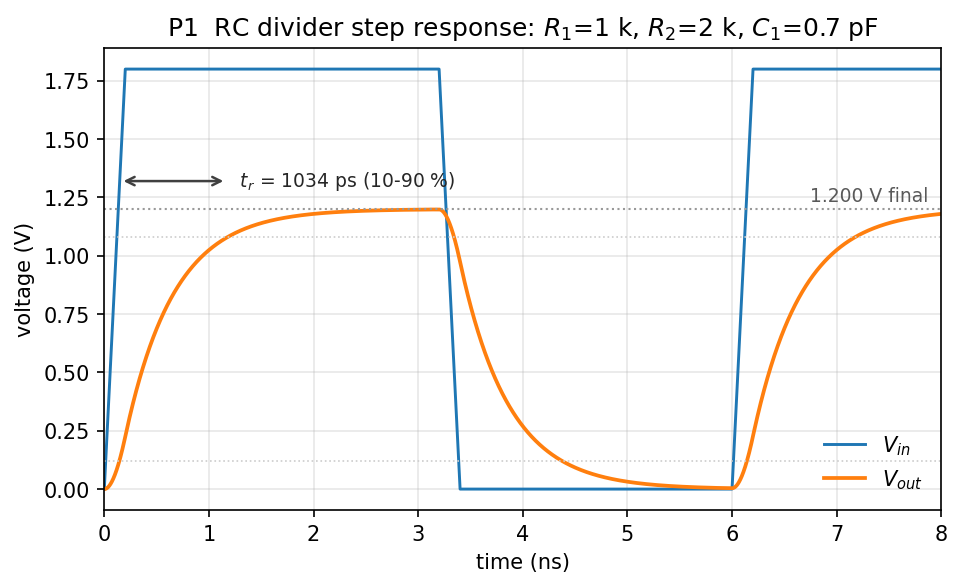
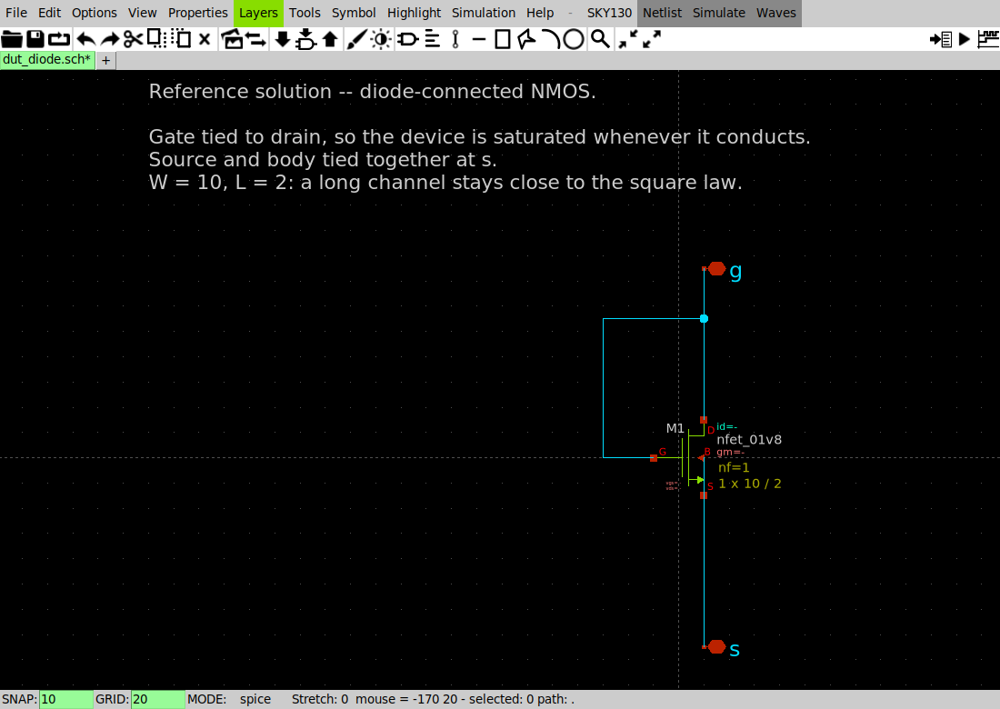
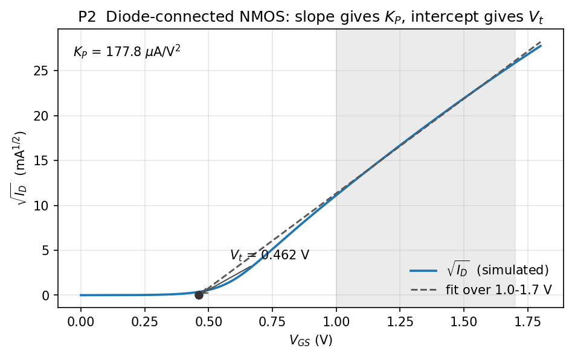
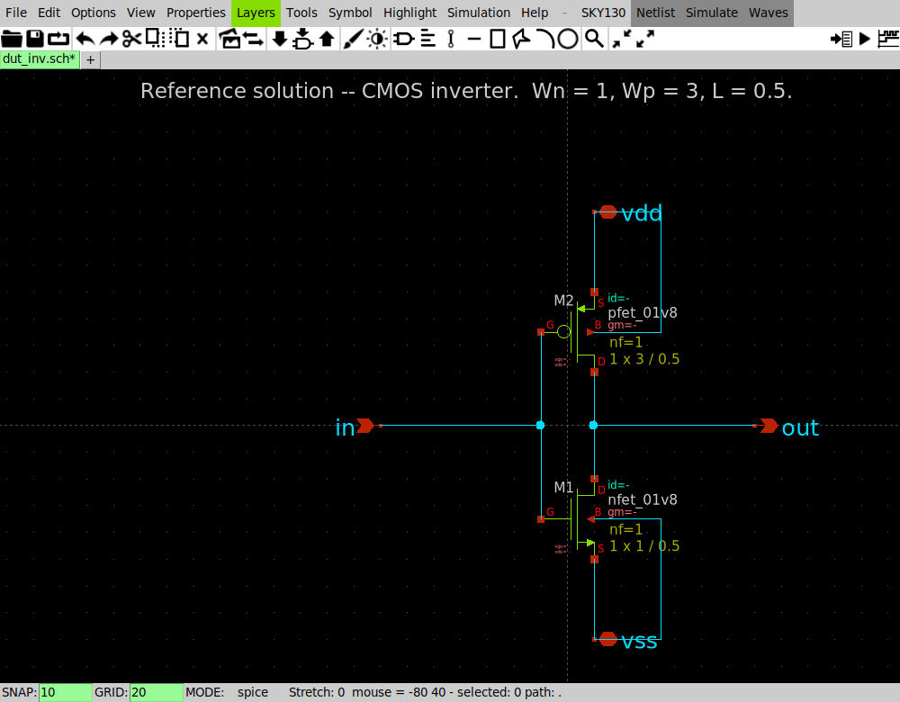
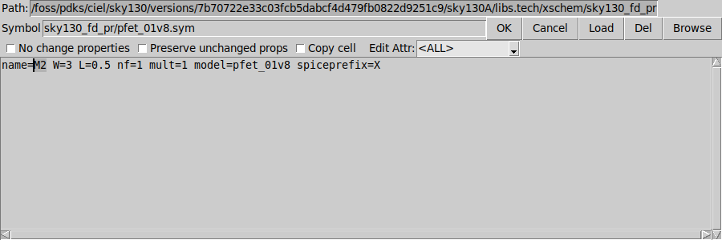
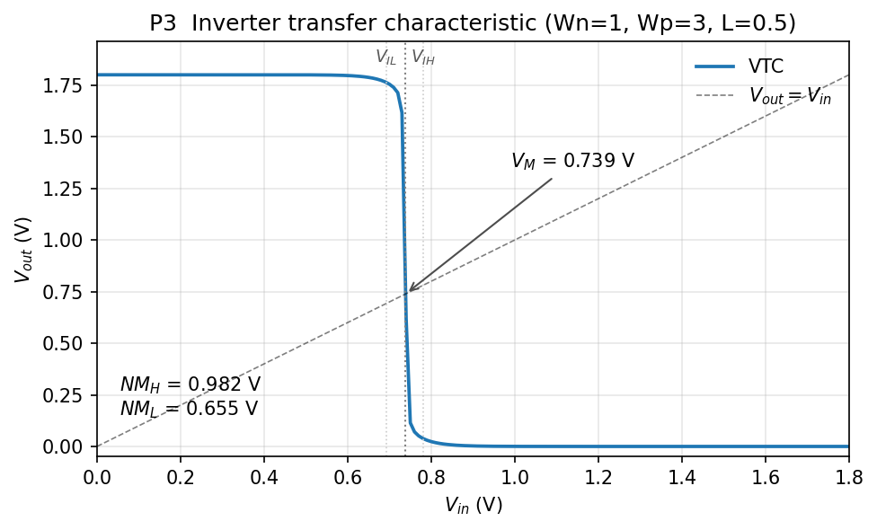
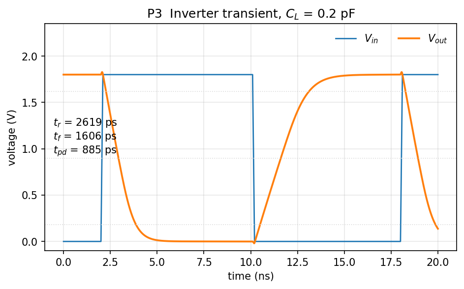
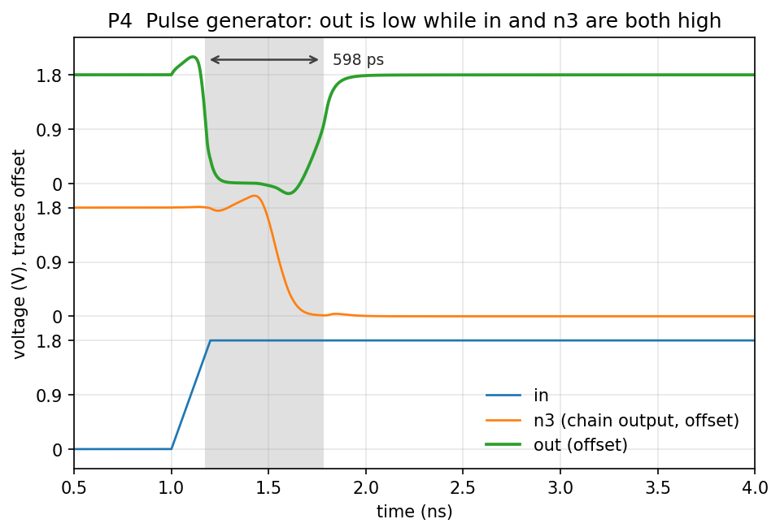

# Lab 1 — Basic SPICE simulations

*ECE334 — Digital Electronics — SKY130 open-source flow*

## Objective

Use XSchem and ngspice to simulate four circuits, and analyse each result in
Python. You start with an RC network, extract the device parameters $K_P$ and
$V_t$ from a diode-connected transistor, characterise a CMOS inverter, and
finish by building a pulse generator and sizing it for a specified pulse width.

Every section has two halves. **Preparation** is hand analysis, done before the
lab session. **Lab Work** is the simulation that checks it. Bring the
preparation with you; the lab is short if you have done it and long if you have
not.

## Course conventions

--8<-- "includes/conventions.md"

## The tools

| File | Purpose |
|------|---------|
| `xschem/*_tb.sch` | Testbenches: stimulus, load, supply, and launcher buttons. You build your circuit inside the DUT. |
| `lab1.ipynb` | Your report. Loads each result, measures it, and holds your answers. |
| `spice/*.spice` | The same circuits as plain decks, if you prefer the command line. |

Start the environment, then:

```bash
. /foss/designs/common/.designinit
cd /foss/designs/lab1_spice
xschem xschem/rc_tb.sch &
```

Each testbench carries three buttons:

- **Netlist & Simulate** — saves, netlists, and runs ngspice. Writes a named
  `.raw` file.
- **Annotate OP** — overlays DC operating-point voltages on the schematic.
- **Run analysis notebook** — executes `lab1.ipynb`.

The notebook finds results by filename through `sim.raw("rc_tb.raw")`, so it
does not matter which directory you started XSchem from.

### Net names

The testbench and the notebook agree through net names. Use these and the
analysis works unchanged:

| Net | Meaning |
|-----|---------|
| `in` | stimulus input |
| `out` | the output you measure |
| `n3` | chain output, P4 only |
| `vdd` / `vss` | 1.8 V supply / ground |

A DUT is an empty box symbol carrying exactly these pins. Open it, build your
circuit inside, and leave the pin names alone.

---

## Preparation

### P1 — RC divider


*`rc_tb.sch`. The source, R1, R2 and C1 are wired by net name; the launcher
buttons are on the left.*

A 1.8 V step drives $R_1 = 1\ \mathrm{k}\Omega$ into the node `out`, which is
loaded by $R_2 = 2\ \mathrm{k}\Omega$ in parallel with $C_1 = 0.7\ \mathrm{pF}$.
The input pulse has $t_r = t_f = 0.2$ ns, a width of 3 ns, and a period of 6 ns.

Derive, by hand:

$$
V_{out}(\infty) = V_{DD}\frac{R_2}{R_1+R_2},
\qquad
\tau = (R_1 \parallel R_2)\,C_1,
\qquad
t_r\,(10\text{–}90\%) = \tau \ln 9
$$

Sketch $V_{in}$ and $V_{out}$ over the first 15 ns.

### P2 — Device parameters

A diode-connected transistor has its gate tied to its drain, so $V_{GS} =
V_{DS}$ and the device is saturated whenever it conducts:

$$
I_D = \tfrac{1}{2} K_P \frac{W}{L}\,(V_{GS}-V_t)^2
\quad\Longrightarrow\quad
\sqrt{I_D} = \sqrt{\tfrac{1}{2}K_P \tfrac{W}{L}}\;(V_{GS}-V_t)
$$

$\sqrt{I_D}$ is therefore linear in $V_{GS}$. Fitting a line to it over the
strong-inversion region gives both parameters:

$$
K_P = \frac{2m^2}{W/L}, \qquad V_t = \text{the x-intercept}
$$

where $m$ is the fitted slope. Write down how you will obtain $K_P$ and $V_t$
from a fitted slope and intercept before you run anything.

### P3 — Inverter timing

Model a conducting transistor as a resistor:

$$
R_{eq} = \frac{V_{DD}}{K_P \frac{W}{L}\,(V_{DD}-|V_t|)}
$$

The inverter's output then charges and discharges $C_L$ exactly as the RC
network in P1 did, so:

$$
t_r \approx 2.2\,R_{eq,p}\,C_L, \qquad t_f \approx 2.2\,R_{eq,n}\,C_L
$$

With $W_n = 1$, $W_p = 3$, $L = 0.5$ and $C_L = 0.2$ pF, compute $R_{eq,n}$,
$R_{eq,p}$, $t_r$ and $t_f$. Leave $K_P$ and $V_t$ symbolic — you measure them
in L2 and substitute afterwards.

### P4 — Pulse generator


*`pulsegen_tb.sch`. The DUT exposes `n3`, the chain output, so the testbench can
plot it beside `in` and `out`.*

Three inverters in series feed one input of a NAND; the undelayed signal feeds
the other. Write the NAND truth table, then state what `out` does when `in`
rises, and explain why the resulting pulse width equals the delay of the
inverter chain.

Using your P3 expression for a single inverter's delay, write the pulse width in
terms of $R_{eq}$ and the capacitance at each chain node.

---

## Lab Work

### L1 — RC step response

Open `xschem/rc_tb.sch` and press **Netlist & Simulate**. It writes `rc_tb.raw`.
Run section P1 of `lab1.ipynb`:

```python
rc = sim.raw("rc_tb.raw")
t_rise, _ = measure.edges_10_90(rc, "out", vdd=1.2)
print(f"t_rise = {t_rise*1e12:.1f} ps,  tau = {t_rise/np.log(9)*1e12:.1f} ps")
plot.transient(rc, ["in", "out"])
```


*Measured 10–90 % rise time, 1034 ps. The output settles at 1.198 V, not the
1.8 V rail, because $R_1$ and $R_2$ divide it.*

Compare against P1. The reference build measures:

| Quantity | Hand | Simulated |
|---|---|---|
| $V_{out}(\infty)$ | 1.200 V | 1.198 V |
| $t_r$ (10–90 %) | 1025 ps | 1034 ps |
| $\tau$ | 466.7 ps | 470.8 ps |

Read $\tau$ from $t_r/\ln 9$ rather than from the 63.2 % point. The input takes
0.2 ns to rise, so there is no single instant the step "starts", and a 63.2 %
reading taken from $t = 0$ is about 16 % high.

Change $R_1$ or $C_1$, re-simulate, and confirm $\tau$ tracks $(R_1\parallel
R_2)C_1$.

### L2 — Extract $K_P$ and $V_t$

Open `xschem/diode_tb.sch` and build a diode-connected NMOS in the DUT: gate and
drain to `g`, source and body to `s`, `W = 10`, `L = 2`.


*`dut_diode.sch` completed. The gate connects back to the drain; source and body
are tied at `s`.*

!!! warning "Enter W and L without a `u`"
    Type `W=10` and `L=2`, not `W=10u`/`L=2u`. The SKY130 models are binned on
    plain micron numbers; a value in metres falls outside every bin and ngspice
    stops with *"could not find a valid modelname"*. This is the most common
    first-simulation failure in this course.

Press **Netlist & Simulate**, then run section P2 of the notebook:

```python
d = sim.raw("diode_nmos.raw")
res = measure.extract_square_law(d["g"], d["id"], wl=10/2, vmin=1.0, vmax=1.7)
print(res["Vt"], res["KP"])
```


*The fit is taken over 1.0–1.7 V (shaded), where the device is strongly
inverted. Extending it below about 0.8 V bends the curve and biases both
parameters.*

The reference build gives $V_{tn} = 0.462$ V and $K_{Pn} = 177.8\ \mu$A/V².
Repeat with a PMOS to obtain $|V_{tp}|$ and $K_{Pp}$. **Record all four
numbers** — L3 and L4 need them.

Your values will differ slightly with the fit window. That is the point: the
square law is an approximation to a short-channel device, and the parameters you
get depend on where you fit it.

### L3 — Inverter

Build the inverter in the DUT of `xschem/inv_tb.sch`: $W_n = 1$, $W_p = 3$,
$L = 0.5$.


*`dut_inv.sch` completed. PMOS source to `vdd`, NMOS source to `vss`, both
bodies tied to their own source, drains joined at `out`.*

Selecting a device and pressing `q` opens its properties:


*`W=3 L=0.5` on the PMOS. `spiceprefix=X` and the diffusion geometry are filled
in by the symbol — you only set W and L.*

Press **Netlist & Simulate**. It writes `inv_tb_vtc.raw` (DC sweep) and
`inv_tb_tran.raw` (transient).

**Transfer characteristic.** Run notebook section P3a:


*$V_M = 0.739$ V, below mid-rail. $NM_H = 0.982$ V and $NM_L = 0.655$ V.*

Report $V_M$, $NM_H$ and $NM_L$. $V_M$ sits below $V_{DD}/2$: $W_p/W_n = 3$ does
not fully compensate the mobility ratio in this process. Say what you would
change to move $V_M$ to mid-rail, and what that costs.

**Transient.** Run section P3b:


*$t_r = 2619$ ps, $t_f = 1606$ ps, $t_{pd} = 885$ ps with $C_L = 0.2$ pF.*

Substitute your extracted $K_P$ and $V_t$ into the P3 expressions and compare.
Expect the hand estimate to be optimistic. Account for the gap: velocity
saturation makes the real device weaker at high $V_{GS}$ than the square law
predicts, and $R_{eq}$ ignores the output-node diffusion capacitance.

### L4 — Pulse generator

Build the circuit in the DUT of `xschem/pulsegen_tb.sch` from the `inv` and
`nand2` cells in `common/xschem`. Press `Shift-I` to open the symbol browser.
Wire the last chain node to the `n3` port.

Press **Netlist & Simulate**, then run notebook section P4:


*`in` rises; `n3` is still high for the length of the chain delay; both NAND
inputs are high over that window, so `out` is low for 598 ps.*

Measure the pulse width between the 50 % points. The reference build gives
**598.4 ps**. Compare with your P4 prediction.

**Design task.** Add a capacitor at `n3` and size it so the pulse width is
**1.5 ns**. Predict the value first from your measured $R_{eq}$ — the extra
delay a load $C$ adds to one stage is $\approx 0.69\,R_{eq}C$ — then confirm by
simulation. State the value you predicted, the value you used, and the width you
measured.

Sizing by trial and error and reporting only the final number is not sufficient;
the prediction is the exercise.

---

## Expected results

Submit the executed `lab1.ipynb`. It must contain, for each section, your hand
analysis, the measured value, and a written comparison.

- [ ] **L1** — $V_{in}$ and $V_{out}$ plot; measured $\tau$ and $t_r$ against P1.
- [ ] **L2** — NMOS and PMOS fits; $V_{tn}$, $K_{Pn}$, $|V_{tp}|$, $K_{Pp}$.
- [ ] **L3** — VTC with $V_M$, $NM_H$, $NM_L$; transient $t_r$, $t_f$, $t_{pd}$
      against the P3 estimate built from your own parameters.
- [ ] **L4** — pulse-generator waveforms and measured width; the capacitor you
      predicted for 1.5 ns and the width you achieved.

## Extra notes

- Rise and fall times are 10–90 % unless stated otherwise. Propagation delay is
  50 % input to 50 % output. Pulse width is 50 % to 50 %.
- The pulse from this circuit is **low-going**: measure from the falling edge to
  the following rising edge.
- Both routes run the same circuit. `spice/pulsegen.spice` reproduces
  `pulsegen_tb.sch` including the diffusion geometry the XSchem symbols generate
  for you; both give 598.4 ps. A hand-written deck that omits `ad`/`as`/`pd`/`ps`
  runs about 25 % fast.
- To check your files before a demo:
  ```bash
  /foss/designs/scripts/verify_lab.sh lab1_spice
  ```
  It netlists and simulates every testbench and fails loudly on an empty DUT.

## FAQ

**ngspice says "could not find a valid modelname".**
A width or length has a `u` suffix. Use `W=1`, `L=0.5`.

**The netlist contains `IS MISSING !!!!` and no transistors.**
XSchem cannot find a symbol. Re-run `. /foss/designs/common/.designinit`, which
reinstalls the course configuration at `~/.xschem/xschemrc`, then reopen the
schematic.

**`write` fails with "no writable vector found".**
The DUT is still empty, so the nets named in the `.control` block do not exist.
Build the circuit inside the DUT first.

**The notebook cannot find a `.raw` file.**
Press **Netlist & Simulate** before running the cell. Results are written to
`/foss/designs/.xschem/simulations`, and `sim.raw()` looks there and in the
current directory.

**My extracted $K_P$ and $V_t$ differ from the numbers above.**
Expected. They depend on the fit window and on which device you swept. Use your
own values throughout, and say which window you used.
