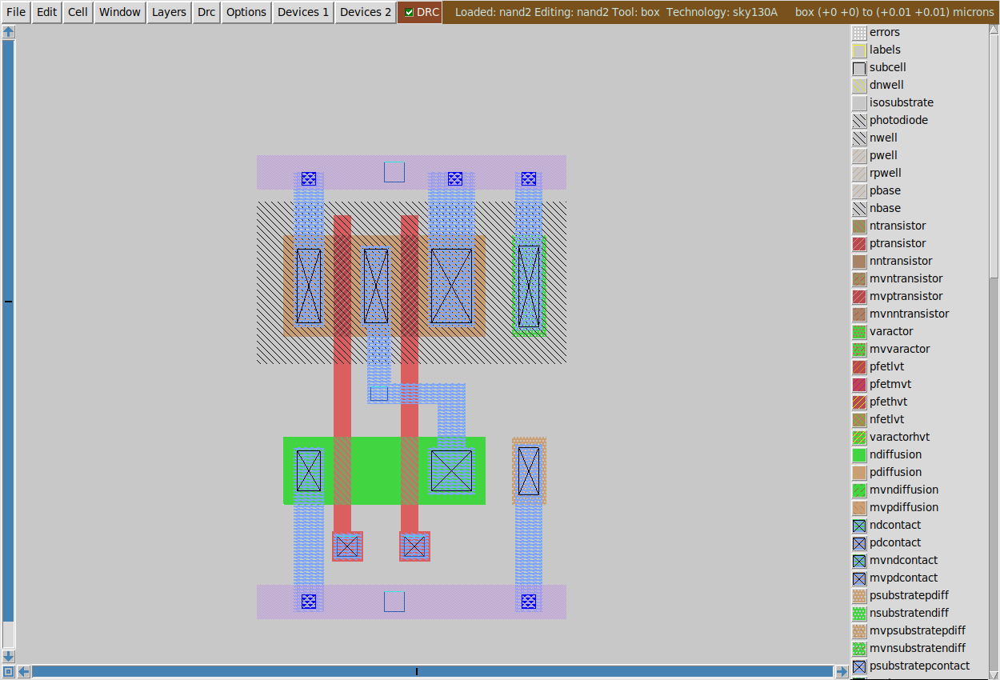
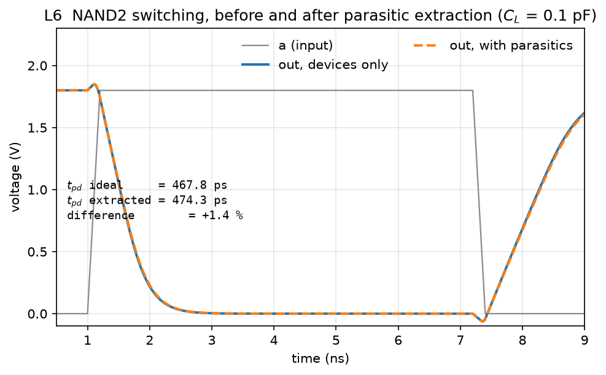
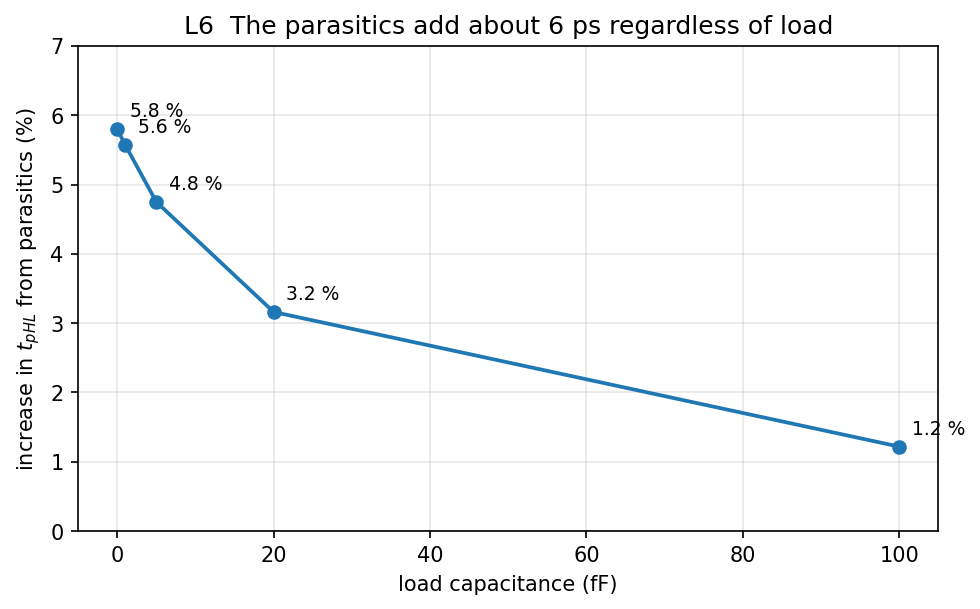

# Lab 2 — NAND gate layout, DRC, LVS and extraction

*ECE334 — Digital Electronics — SKY130 open-source flow*

## Objective

Draw the physical layout of the 2-input NAND you built in Lab 1, prove it is
manufacturable, prove it is the circuit you meant to draw, and then measure what
the physical implementation costs you in speed.

Four checks, in order, each of which can fail independently:

| Check | Question it answers | Tool |
|-------|--------------------|------|
| DRC | Can this be manufactured? | Magic |
| Extraction | What circuit did I actually draw? | Magic |
| LVS | Is that the circuit I intended? | Netgen |
| PEX | What does the physical wiring cost? | Magic + ngspice |

A layout that passes DRC can still be the wrong circuit. A layout that passes
LVS can still be slow. You need all four.

## Course conventions

--8<-- "includes/conventions.md"

## The tools

| File | Purpose |
|------|---------|
| `magic/` | Where you draw the layout. Magic writes `nand2.mag` here. |
| `xschem/nand2_lvs.sch` | Wrapper that instantiates `nand2.sym`, so XSchem emits a `.subckt` for netgen to compare against. |
| `lab2.ipynb` | Your report. Captures the DRC count, the extracted netlist, the LVS verdict, and the delay comparison. |
| `spice/nand2_compare.spice` | The L6 testbench. Runs against either extracted netlist by swapping one `.include`. |

Lab 2 produces mostly tool output rather than waveforms, so the notebook
captures that output rather than re-deriving it. Run its cells after you have
finished in Magic.

The cell is the Lab 1 NAND2: **Wn = 2 (series pair), Wp = 3 (parallel pair),
L = 0.5**. Those are the legacy handout's $(W/L)_p = 24$, $(W/L)_n = 16$ ratios
at this lab's channel length. Ports: `a`, `b`, `out`, `vdd`, `vss` — the same
names as `common/xschem/nand2.sch`, so LVS compares like with like.

## Preparation

### P1 — Read the Magic tutorial

Work through the MAX/Magic tutorial on Quercus before the session. The
[Magic cheatsheet](../../reference/magic-cheatsheet.md) is the short version.

### P2 — Draw a stick diagram

On paper, with coloured pens, sketch the NAND2 as a stick diagram. Do not use
metal2 and do not worry about exact dimensions. Decide, before you touch the
tool:

- which diffusion strip is NMOS and which is PMOS;
- where each poly gate crosses;
- which diffusion regions are shared, and which need a contact;
- where the two supply rails run, and where the well and substrate taps go.

The series NMOS pair shares its middle diffusion region with no contact at all.
Convince yourself that is legal before you draw it.

### P3 — Predict the parasitics

The layout adds capacitance the schematic does not have: diffusion to substrate,
poly to substrate, and interconnect to everything nearby. Before L6, write down
whether you expect that to matter more when the gate drives a large load or a
small one, and why.

---

## Lab Work

### L1 — Set up

```bash
. /foss/designs/common/.designinit
cd /foss/designs/lab2_layout
echo "source \$PDK_ROOT/sky130A/libs.tech/magic/sky130A.magicrc" > .magicrc
magic -d X11 -T sky130A nand2 &
```

Use the **X11** driver. Magic opens two windows: the layout, and **tkcon**,
where you type commands.


*The layout window, with the layer palette on the right and the live DRC status
in the toolbar.*

### L2 — Draw the layout

Build the cell. Horizontal diffusion, vertical poly:

- **NMOS**, `ndiff`, 2 µm tall, with two poly stripes crossing it. The regions
  are: source (to `vss`), the shared middle node, and drain (to `out`).
- **PMOS**, `pdiff`, 3 µm tall, inside an `nwell`, with the same two poly
  stripes. Regions: source, shared drain (`out`), source.
- **Contacts** `ndc` and `pdc` on every region that leaves the device — not on
  the NMOS middle node.
- **Taps**: `ptap`/`ptapc` tied to `vss`, `ntap`/`ntapc` inside the nwell tied
  to `vdd`. A layout without taps will extract, and will not work.
- **Rails** in `met1`, connected down to `li` with `mcon`.


*Reference layout. PMOS pair in the nwell (top), series NMOS below, two poly
gates crossing both, `li` routing in blue, `met1` rails top and bottom, and the
two taps at the right.*

!!! warning "Contacts need local interconnect around them"
    Paint `li` over a slightly larger rectangle than the contact itself. The cut
    needs at least 0.08 µm of `li` overhanging it (rule `li.5`), and a contact
    painted with no surrounding `li` fails DRC everywhere it appears. Painting
    `li` first and then the contact inset by 0.1 µm satisfies the rule
    everywhere without measuring each cut.

Label every port: place the box over the shape and type `label a`, and so on for
`b`, `out`, `vdd`, `vss`.

### L3 — DRC to zero

DRC runs continuously; violations appear as white dots with a live count in the
toolbar.

```
drc check
drc count
drc why
```

`drc why` names the rule that was broken. Fix violations by rule, not by
nudging shapes until the dots go away — the rule name tells you the actual
constraint. Target is zero:

```
DRC_COUNT=0
```

### L4 — Declare ports and extract

Extraction turns geometry back into a circuit. Before extracting, tell Magic
which labels are ports, or the extracted subcircuit has no port list and LVS
cannot compare it:

```
select cell
port makeall
port a index 1
port b index 2
port out index 3
port vdd index 4
port vss index 5
save
```

Then extract:

```
extract do local
extract all
ext2spice lvs
ext2spice -o nand2.lvs.spice
```

Read the result. It should contain exactly four devices and your five ports:

```spice
.subckt nand2 a b out vdd vss
X0 out a a_400_0# vss sky130_fd_pr__nfet_01v8 w=2 l=0.5
X1 a_400_0# b vss vss sky130_fd_pr__nfet_01v8 w=2 l=0.5
X2 out b vdd vdd sky130_fd_pr__pfet_01v8 w=3 l=0.5
X3 vdd a out vdd sky130_fd_pr__pfet_01v8 w=3 l=0.5
.ends
```

`a_400_0#` is the internal node between the series NMOS devices. Magic named it
after its coordinates because you never labelled it — which is fine, because it
is not a port.

Check the widths and lengths against what you drew. If `w` is not 2 and 3, the
diffusion is the wrong height.

### L5 — LVS

Netgen compares the extracted layout against the schematic. Both sides need a
`.subckt` of the same name.

!!! warning "Netlist the schematic through a wrapper"
    Netlisting `nand2.sch` on its own emits its devices at the **top level**
    with no `.subckt` around them, and netgen then reports *"Cannot find cell
    nand2"*. Netlist a schematic that **instantiates** `nand2.sym` instead.

```bash
/foss/designs/scripts/run_lvs.sh nand2.lvs.spice xschem/nand2_lvs.sch
```

The second argument is the *wrapper* schematic, not `nand2.sch`. The script
netlists it, checks that a `.subckt nand2` actually came out, and only then
calls netgen — so a missing subcircuit is reported as that, rather than as
netgen's less obvious *"Cannot find cell"*.

The result you want:

```
Netlists match uniquely.
Final result: Circuits match uniquely.
```

Two distinct failures are worth recognising:

- **"Netlists match uniquely" but "failed pin matching".** The topology is
  right and the port *names* are permuted. A NAND is symmetric in its inputs, so
  netgen matches the circuit and still reports that `a` and `b` are the wrong way
  round. Swap the two labels in the layout.
- **Device or net counts differ.** Something is genuinely missing — usually an
  unlabelled port, or a contact you meant to place and didn't.

### L6 — Extract parasitics and measure the cost

Extract again, this time keeping the capacitances:

```
extract all
ext2spice cthresh 0
ext2spice -o nand2.pex.spice
```

`cthresh 0` keeps every coupling capacitance. Without it the small ones are
dropped and the comparison shows nothing. The reference layout yields 14
capacitors, totalling a few femtofarads.

Simulate both netlists with the same testbench, changing only the `.include`:

```bash
ngspice -b spice/nand2_compare.spice
```


*With a 0.1 pF load the two traces almost coincide: 467.8 ps against 473.5 ps,
a 1.2 % difference.*

That looks like a disappointing result. It is the correct one, and the reason is
the point of the exercise. Sweep the load and measure again:


*The parasitics add a roughly fixed 6 ps. Their share of the total delay is
5.8 % with no load and 1.2 % at 0.1 pF.*

| $C_L$ | ideal | extracted | change |
|-------|-------|-----------|--------|
| 0 | 100.0 ps | 105.8 ps | +5.8 % |
| 1 fF | 104.0 ps | 109.8 ps | +5.6 % |
| 5 fF | 120.0 ps | 125.7 ps | +4.8 % |
| 20 fF | 177.1 ps | 182.7 ps | +3.2 % |
| 100 fF | 467.8 ps | 473.5 ps | +1.2 % |

Layout parasitics are an approximately fixed additive load. They dominate when a
gate drives a short local wire and vanish into the noise when it drives a long
one. Compare this against your P3 prediction.

---

## Expected results

Submit the executed `lab2.ipynb`, with the layout plot attached.

- [ ] **L2** — layout plot of your NAND2
- [ ] **L3** — `drc count` = 0
- [ ] **L4** — extracted netlist showing four devices with the right W and L
- [ ] **L5** — Netgen output reading **Circuits match uniquely**
- [ ] **L6** — pre- and post-PEX waveforms, $t_{pHL}$, $t_{pLH}$, $t_r$, $t_f$
      for both, and the delay-versus-load comparison with a written explanation

## Extra notes

- The middle NMOS diffusion carries no contact. Series devices share diffusion
  directly; adding a contact there wastes area and adds capacitance to an
  internal node.
- Ignore the legacy handout's "L = 2 squares wide" annotation. Set the channel
  length from the poly stripe width, 0.5 µm.
- You do not have to match the reference layout's contact count. Dimensions
  matter; contact arrays do not.
- Magic reads commands on stdin even with the GUI open, which is the reliable
  way to script it:
  ```bash
  ( echo "drc check"; echo "drc count"; sleep 200 ) | magic -d X11 -T sky130A nand2.mag &
  ```

## FAQ

**`Failed to load technology`.**
No `.magicrc` in the directory you started Magic from. Create it as in L1.

**The layout is one empty rectangle with a name in it.**
An unexpanded subcell. Press `x`.

**Every contact reports `li.5`.**
The contacts have no local interconnect overhanging them. Paint `li` over a
rectangle 0.1 µm larger than each contact.

**Netgen says `Cannot find cell nand2 in file …`.**
The schematic netlist has no `.subckt`. Netlist a wrapper that instantiates
`nand2.sym` rather than `nand2.sch` itself.

**LVS reports a pin mismatch but says the netlists match.**
The inputs are swapped. Rename the two poly labels in the layout.

**The pre- and post-PEX waveforms look identical.**
They nearly are, at a 0.1 pF load — see L6. Reduce the load to make the
difference visible, and report both.
