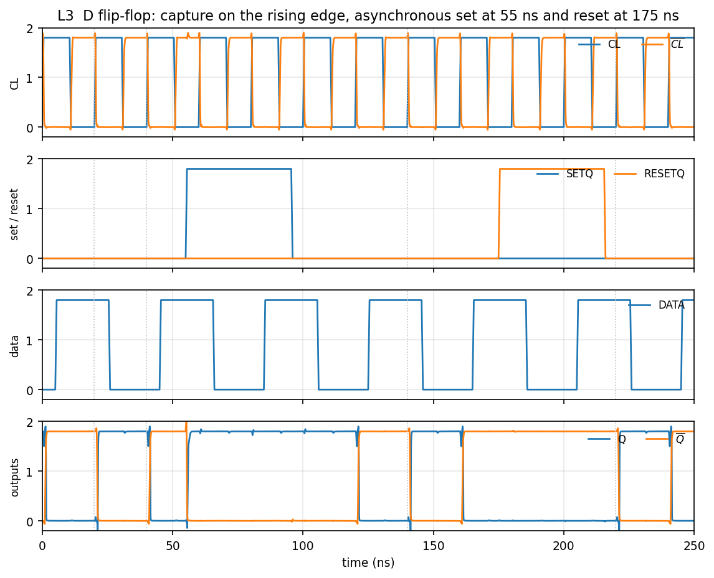
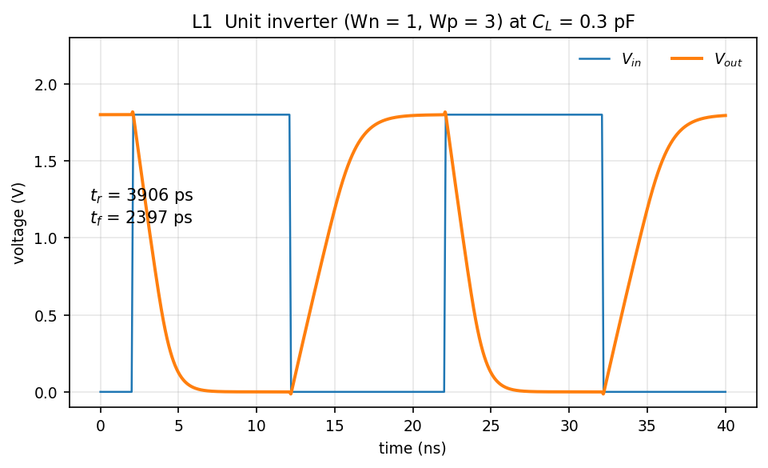
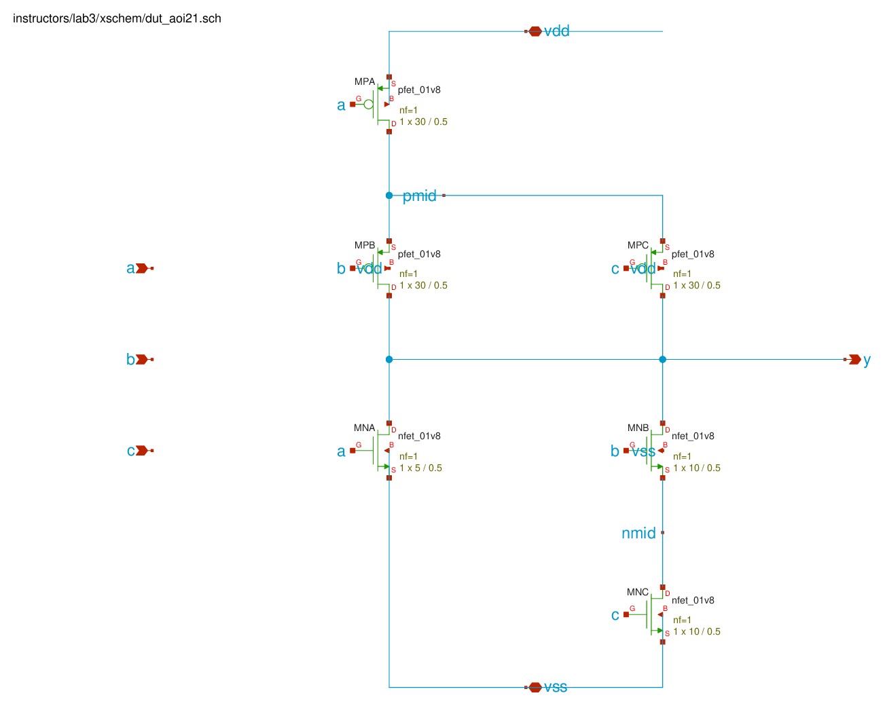
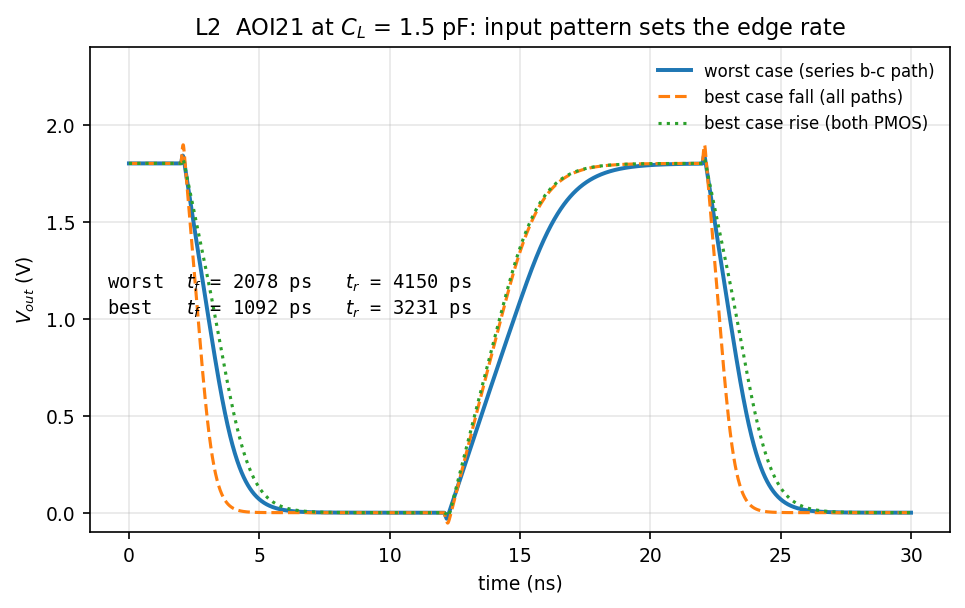
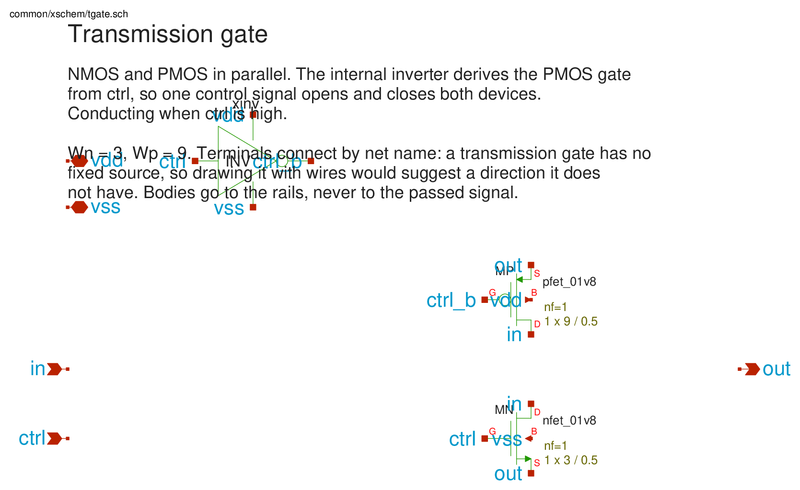
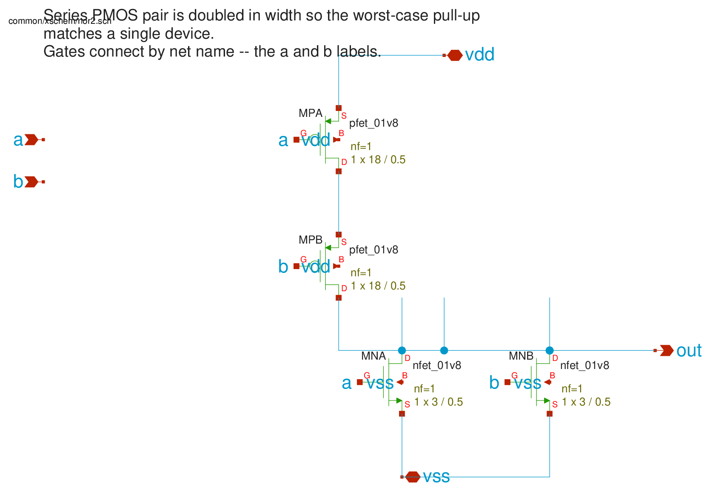
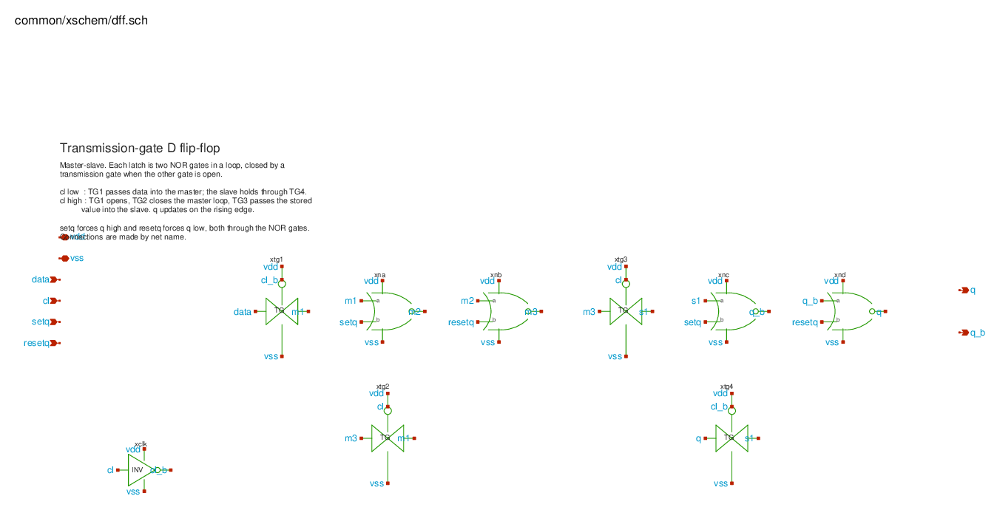

# Lab 3 — Digital circuit simulations

*ECE334 — Digital Electronics — SKY130 open-source flow*

## Objective

Size gates so they meet a timing target, and verify a sequential circuit.

Three circuits, in increasing order of difficulty: a unit inverter you
characterise, a complex gate you size yourself from that characterisation, and
a flip-flop you assemble from cells and verify functionally.

## Course conventions

--8<-- "includes/conventions.md"

Use your **own** $K_P$ and $V_t$ from Lab 1 L2 throughout. The numbers quoted
here come from the reference extraction and yours will differ.

Lab 3 sizing:

| Cell | Sizing |
|---|---|
| Unit inverter | Wn = 1, Wp = 3 |
| AOI21 | see P2 |
| Transmission gates, clock inverter | Wn = 3, Wp = 9 |
| NOR gates in the flip-flop | Wn = 3, Wp = 18 (series pair doubled) |

---

## The tools

| File | Purpose |
|------|---------|
| `xschem/aoi21_tb.sch` | AOI21 testbench. Build the gate inside the DUT. |
| `xschem/dff_tb.sch` | Flip-flop testbench, wired for the four-panel plot. |
| `lab3.ipynb` | Your report. Loads each result, measures it, and holds your answers. |
| `spice/*.spice` | The same circuits as plain decks, if you prefer the command line. |
| `common/xschem/` | The shared cells the flip-flop is built from: `inv`, `nand2`, `nor2`, `tgate`. |

## Preparation

### P1 — Unit inverter driving 0.3 pF

Model each conducting device as $R_{eq}$, as in Lab 1 P3:

$$
R_{eq} = \frac{V_{DD}}{K_P \frac{W}{L}(V_{DD}-|V_t|)},
\qquad
t_f \approx 2.2\,R_{eq,n}C_L,
\qquad
t_r \approx 2.2\,R_{eq,p}C_L
$$

With $W_n = 1$, $W_p = 3$, $L = 0.5$ and $C_L = 0.3$ pF, compute $t_r$ and
$t_f$ from your own extracted parameters.

### P2 — A complex gate

Draw the CMOS gate for

$$Y = \overline{A + B\cdot C}$$

The pull-down network conducts when $A + BC$ is true: one NMOS for $A$, in
**parallel** with a **series** pair for $B$ and $C$. The pull-up network is the
dual: one PMOS for $A$ in **series** with a **parallel** pair for $B$ and $C$.

**(a)** Identify the input conditions that give the worst-case and the best-case
rise and fall times. For each of the four, say which devices are conducting.

**(b)** Size the transistors so that in the **worst case** the gate matches the
unit inverter's edge rates from P1 while driving **1.5 pF** — five times the
load.

Two rules do the work. Devices in series each need their width multiplied by the
number in the path, because $n$ equal devices in series behave like one device
of $1/n$ the width. And driving $5\times$ the load in the same time needs
$5\times$ the width.

Starting from the unit inverter, this gives:

| Device | Width |
|---|---|
| NMOS $a$ (alone in its path) | 5 |
| NMOS $b$, $c$ (series pair) | 10 each |
| PMOS $a$ (in series with one of $b$, $c$) | 30 |
| PMOS $b$, $c$ (parallel, but each in series with $a$) | 30 each |

Derive these yourself before comparing.

**(c)** Estimate the worst-case rise and fall times with the $R_{eq}$ model,
neglecting diffusion capacitance, and compare with the unit inverter of P1.

**(d)** Estimate the best-case rise and fall times.

### P3 — The flip-flop


*What the finished circuit does. CL and $\overline{CL}$; SETQ and RESETQ; DATA;
Q and $\overline{Q}$.*

The flip-flop is a master-slave pair. Each latch is two NOR gates in a loop that
a transmission gate closes when the input gate is open:

```
master   TG1 (CL_b) : data -> m1
         NOR_A (m1, SETQ)      -> m2
         NOR_B (m2, RESETQ)    -> m3
         TG2 (CL)   : m3 -> m1        hold while the clock is high
slave    TG3 (CL)   : m3 -> s1
         NOR_C (s1, SETQ)      -> Q_b
         NOR_D (Q_b, RESETQ)   -> Q
         TG4 (CL_b) : Q  -> s1        hold while the clock is low
```

Write the truth table. Cover, at minimum: what Q does on a rising clock edge,
what it does between edges, and what SETQ and RESETQ do irrespective of the
clock. Explain why the two transmission gates in each latch are driven by
opposite clock phases.

---

## Lab Work

### L1 — Unit inverter

Simulate the unit inverter with $C_L = 0.3$ pF.

```bash
. /foss/designs/common/.designinit
cd /foss/designs/lab3_digital
ngspice -b spice/unit_inv.spice
```


*Reference build: $t_r$ = 3906 ps, $t_f$ = 2397 ps at $C_L$ = 0.3 pF.*

| Quantity | Reference |
|---|---|
| $t_r$ (10–90 %) | 3906 ps |
| $t_f$ (90–10 %) | 2397 ps |
| $t_{pHL}$ | 1295 ps |
| $t_{pLH}$ | 2143 ps |

Compare with your P1 estimate. These are the numbers the AOI21 must match in
L2, at five times the load.

### L2 — The complex gate

Build your AOI21 in the DUT of `xschem/aoi21_tb.sch` with the sizes from P2,
then drive it with each of the four input patterns and measure the edges.


*The reference gate. `MPA` carries the whole pull-up current on its own, so the
parallel `MPB`/`MPC` pair hangs below it on `pmid`; `MNA` sits alone against the
series `MNB`/`MNC` pair. Read the two networks against each other — one is the
dual of the other, which is what keeps the output always driven and never
driven both ways at once.*

Getting the patterns right is most of the exercise:

| Case | Hold | Switch | Path |
|---|---|---|---|
| Worst fall | $a=0$, $c=1$ | $b$: 0→1 | series $b$–$c$ only |
| Worst rise | $c=1$ | $b$: 1→0 | $a$ in series with $b$ alone |
| Best fall | — | $a$, $b$, $c$ together 0→1 | every pull-down path |
| Best rise | $b=c=0$ | $a$: 1→0 | both parallel PMOS |

!!! warning "The best-case fall needs all three inputs to move together"
    Holding $b=c=1$ and switching $a$ alone does not produce a falling edge at
    all: $B\cdot C$ is already 1, so the output is low before the edge and stays
    there. Switch $a$, $b$ and $c$ together instead.


*Reference build at $C_L$ = 1.5 pF.*

| Case | $t_f$ | $t_r$ |
|---|---|---|
| Worst | 2078 ps | 4150 ps |
| Best | 1092 ps | 3231 ps |

Compare against the unit inverter of L1: 2397 ps and 3906 ps. The reference
sizing lands within about 15 % of the target — rise is 6 % slow and fall is
13 % fast. Account for the direction of each miss.

The reference decks are `spice/unit_inv.spice` and `spice/aoi21_cases.spice`.

### L3 — The flip-flop

Build the flip-flop from the cells in `common/xschem`: four `tgate`, four
`nor2`, and one `inv` for the clock. Sizes are in the conventions table above.


*`tgate`. An NMOS and a PMOS in parallel, driven by opposite gate phases. Note
that neither device has a fixed source: which terminal is the source depends on
which side is higher, which is why the cell is wired by net name rather than
drawn with a source pointing at a rail.*


*`nor2`. Series PMOS above, parallel NMOS below — the mirror image of the NAND
you drew in Lab 0. The series pair is doubled in width for the same reason it
was there.*


*The assembled master–slave pair. `TG1` and `TG2` open on opposite clock
phases, so exactly one of them is conducting at any time: the master is either
listening to `data` or holding. The slave is the same circuit on the other
phase.*

Simulate with:

```
CL      pulse( td=0,     tr=0.5n, tf=0.5n, pw=10n, period=20n  )
DATA    pulse( td=5n,    tr=0.5n, tf=0.5n, pw=20n, period=40n  )
SETQ    pulse( td=55n,   tr=0.5n, tf=0.5n, pw=40n, period=1000n)
RESETQ  pulse( td=175n,  tr=0.5n, tf=0.5n, pw=40n, period=1000n)
```

You need a longer run than the default. Add a SPICE command to the schematic:
press `t`, click anywhere, and type

```
^.tran 10p 250n
```

Produce the four-panel plot shown in P3, and confirm from it that:

- Q takes the value DATA held just before each rising clock edge, and holds it
  between edges;
- SETQ forces Q high and RESETQ forces Q low, regardless of the clock;
- Q and $\overline{Q}$ are complementary except during a transition.

The first clock cycle is not meaningful. The feedback loops start from an
arbitrary state and take a cycle to settle; ignore anything before the first
rising edge at 20 ns.

---

## Expected results

Submit the executed `lab3.ipynb`. It must contain, for each section, your hand
analysis, the measured value, and a written comparison.

- [ ] **P1/L1** — analytic against simulated $t_r$ and $t_f$ for the unit inverter
- [ ] **P2/L2** — AOI21 schematic; the four input patterns identified; worst- and
      best-case $t_r$/$t_f$ against your estimates and against L1
- [ ] **P3/L3** — flip-flop truth table; four-panel plot; a statement of what
      each panel demonstrates

## Extra notes

- Series devices are widened by the number in the path. That is why the AOI21's
  $b$ and $c$ NMOS are 10 while its $a$ NMOS is 5.
- The flip-flop's NOR gates carry a doubled PMOS width for the same reason: two
  PMOS in series must each be twice as wide to pull up like one.
- A transmission gate has no fixed source terminal, so its body connections go
  to the rails and never to the signal being passed.
- Check your files before a demo:
  ```bash
  /foss/designs/scripts/verify_lab.sh lab3_digital
  ```

## FAQ

**The output waveform does not look like a gate at all.**
Check the input pulse width. If the output has not finished settling before the
next input edge, everything after that is meaningless. Widen the pulse and the
period together.

**My AOI21 best-case fall never falls.**
See the warning in L2: with $b=c=1$ the output is already low.

**Q never changes.**
Either the clock inverter is missing, so both transmission gates in a latch are
driven by the same phase and the latch never opens, or SETQ/RESETQ is stuck
high. Plot $\overline{CL}$ and confirm it is the complement of CL.

**Q oscillates or settles between the rails.**
A feedback loop is closed at both ends at once. Confirm TG1 and TG2 are driven
by opposite phases, and likewise TG3 and TG4.

**The first cycle looks wrong.**
It is. The loops start in an arbitrary state; ignore it, or add
`^.ic v(q)=0` to force a starting value.
