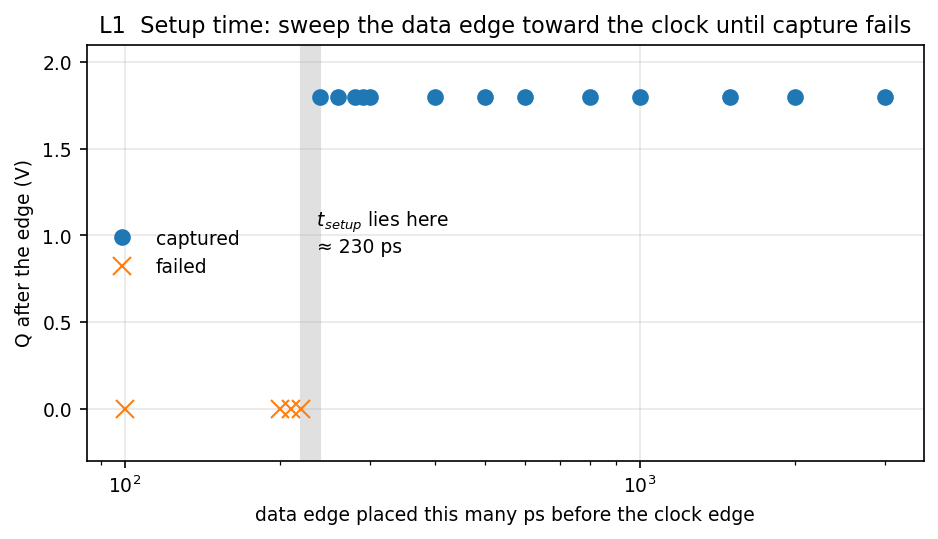
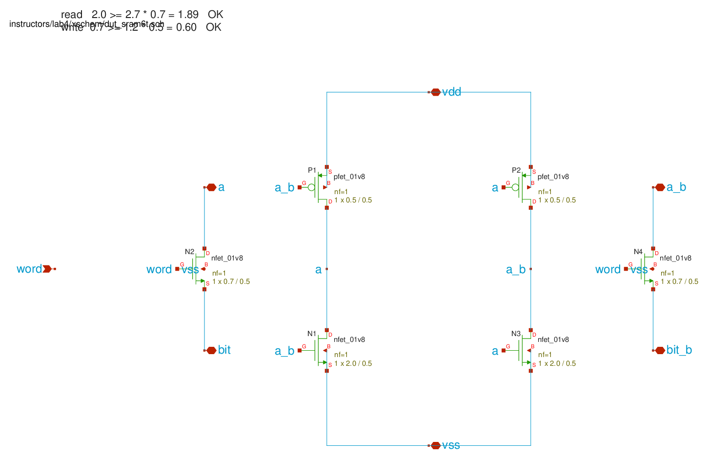
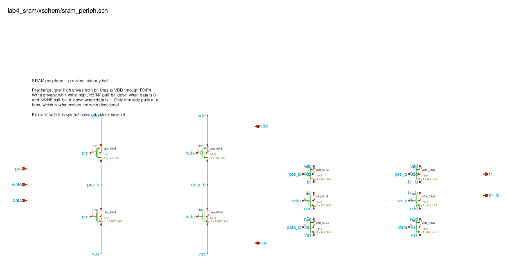
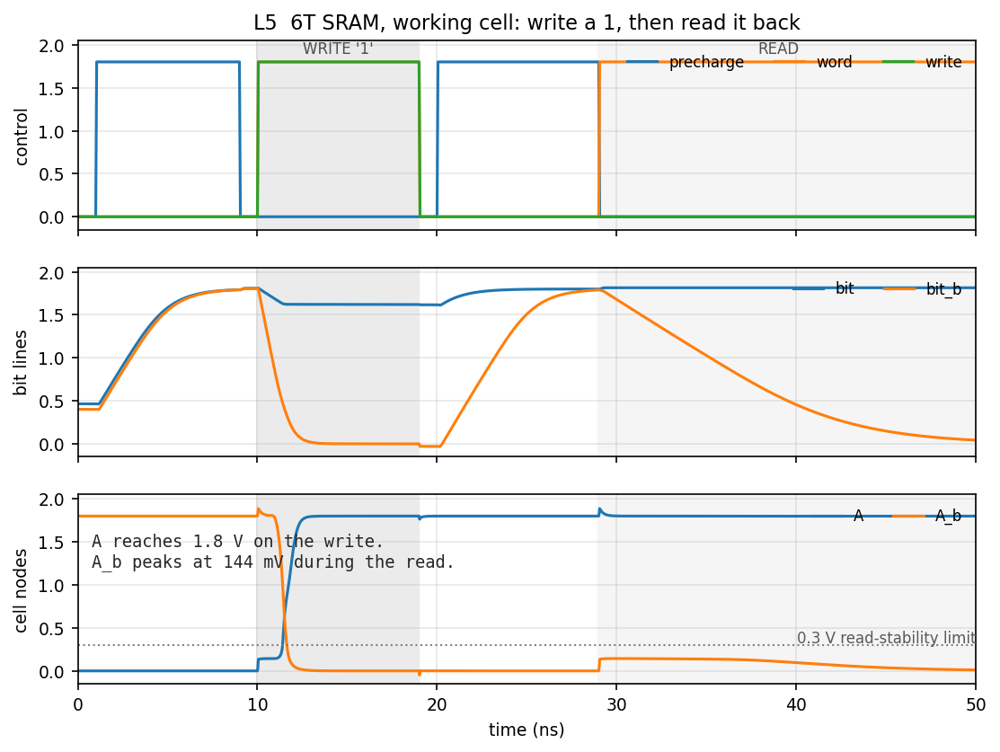
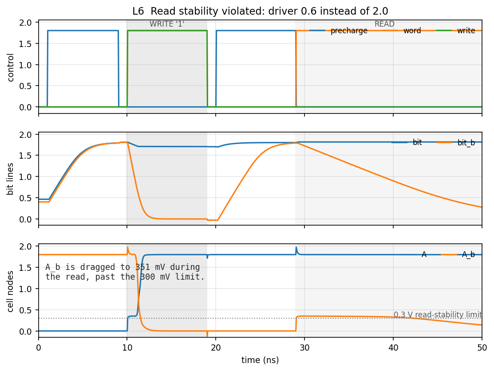
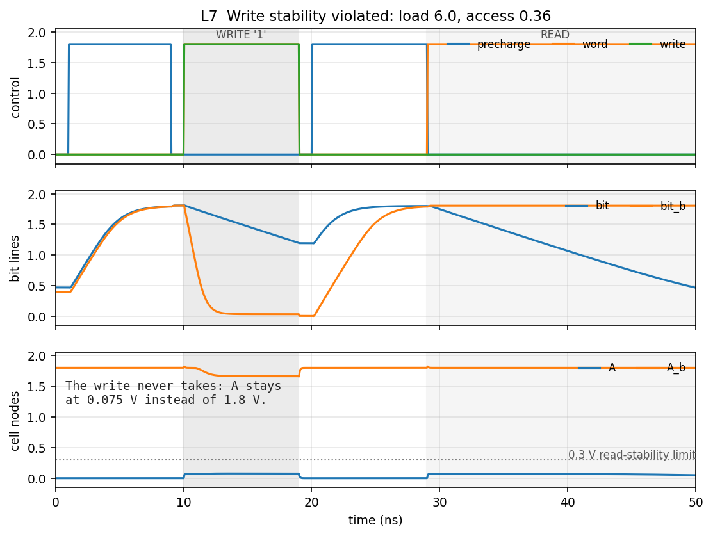

# Lab 4 — Flip-flop characterization and the 6T SRAM cell

*ECE334 — Digital Electronics — SKY130 open-source flow*

## Objective

Characterise the flip-flop you built in Lab 3, use its numbers to predict the
maximum clock frequency of a real path, and then design a 6T SRAM cell against
two competing stability constraints — and break each one deliberately to see
what failure looks like.

## References

Textbook section 12.2.1, *Memory cell read/write operation*.

## Course conventions

--8<-- "includes/conventions.md"

| Device | Width |
|---|---|
| Cell load PMOS, $P_1$ $P_2$ | 0.5 |
| Cell access NMOS, $N_2$ $N_4$ | 0.7 |
| Cell driver NMOS, $N_1$ $N_3$ | 2.0 |
| Periphery: precharge and write drivers | 8 |

Bit-line capacitance is 1 pF on each side. Ignore the body effect in hand
analysis.

## The tools

| File | Purpose |
|------|---------|
| `xschem/sram6t_tb.sch` | SRAM testbench: stimulus, bit-line capacitance, and the provided periphery. Build your cell inside the DUT. |
| `xschem/sram_periph.sch` | The precharge devices and write drivers, already built. Select it and press `e` to look inside. |
| `xschem/dff_wrap.sch` | Wrapper that makes XSchem emit `.subckt dff` for the flip-flop decks to include. |
| `lab4.ipynb` | Your report. Sweeps the setup time, measures $t_{PCQ}$ and $f_{max}$, and analyses all three SRAM cases. |
| `spice/dff_char.spice` | Flip-flop characterization deck (L1, L2). |
| `spice/dff_chain.spice` | Two flip-flops and four inverters (L3). |
| `spice/sram6t*.spice` | The SRAM cell, nominal and with each stability condition broken. |

The design exercise here is the six transistors of the cell. The periphery is
provided so that a wiring mistake in the write drivers cannot be mistaken for a
sizing mistake in the cell — but read it, because L5 asks you to explain what
it does.

---

## Preparation

### P1 — Size the SRAM cell

The 6T cell is two cross-coupled inverters ($P_1$/$N_1$ and $P_2$/$N_3$) plus
two access transistors ($N_2$, $N_4$) joining the internal nodes to the bit
lines. It has to satisfy two constraints that pull in opposite directions.

**Read stability.** During a read, both bit lines are precharged high and the
word line turns on both access devices. The access device connected to the low
internal node forms a divider with that node's driver, and the low node rises.
It must stay below 0.3 V or the cell can flip while merely being read:

$$W_{N1} \geq 2.7\,W_{N2}$$

**Write stability.** During a write, the driver holds one bit line at 0 and the
access device must overpower the load PMOS holding that internal node high:

$$W_{N2} \geq 1.2\,W_{P1}$$

Read time is not critical, so make the smallest devices minimum sized to keep
the cell area down. Determine all six widths. Show that your choice satisfies
both inequalities.

The reference build uses $W_{P} = 0.5$, $W_{access} = 0.7$, $W_{driver} = 2.0$:

$$2.0 \geq 2.7 \times 0.7 = 1.89 \quad\checkmark
\qquad
0.7 \geq 1.2 \times 0.5 = 0.60 \quad\checkmark$$

### P2 — Which device would you change?

1. If the **read** stability condition were violated, which transistor(s) would
   you resize, and in which direction?
2. If the **write** stability condition were violated, which transistor(s)?

Answer before L6 and L7, where you break each one on purpose.

### P3 — Stick diagram

Draw a coloured stick diagram of the 6T cell. A neat sketch is enough; exact
design-rule dimensions are not required.

### P4 — Set up the simulation

Build the circuit with its precharge devices and write drivers, driven by the
waveforms in L5. Unit inverters are fine for the precharge and data paths.

---

## Lab Work

### L1 — Setup time

Setup time is the smallest gap between the data edge and the clock edge for
which the flip-flop still captures. Measure it by sweeping that gap:

```bash
. /foss/designs/common/.designinit
cd /foss/designs/lab4_sram
for d in 2000 1000 500 300 240 220 200; do
  sed "s/^.param DSKEW=.*/.param DSKEW=${d}p/" spice/dff_char.spice > spice/_sweep.spice
  printf "%6s ps  " "$d"
  ngspice -b spice/_sweep.spice 2>&1 | grep '^qfinal'
done
rm -f spice/_sweep.spice
```

!!! warning "Write the scratch deck beside the original, not in `/tmp`"
    `dff_char.spice` pulls the flip-flop in with `.include include/dff.spice`, a
    path relative to the deck. Move the deck to `/tmp` and that include no longer
    resolves: ngspice stops with *"Could not find include file"* and the loop
    prints nothing at all. Keeping the copy in `spice/` keeps the path valid.


*Capture succeeds down to 240 ps and fails at 220 ps.*

| Data edge before clock | Q after the edge | Captured |
|---|---|---|
| 300 ps | 1.800 V | yes |
| 240 ps | 1.800 V | yes |
| 220 ps | 0.000 V | **no** |

$t_{setup} \approx 230$ ps for the reference flip-flop. Report the two values
that bracket your own, not a single number you cannot defend.

### L2 — Clock-to-Q delay

On a cycle that does capture, measure from the clock's 50 % point to Q's:

```
meas tran tpcq TRIG v(cl) VAL=0.9 RISE=1 TARG v(q) VAL=0.9 RISE=1
```

Reference: $t_{PCQ} = 1.134$ ns.

### L3 — Two flip-flops and four inverters

Build the path: `DFF1 → inv → inv → inv → inv → DFF2`, both flip-flops on the
same clock, inverters sized as the Lab 3 unit inverter.

```bash
ngspice -b spice/dff_chain.spice
```

The reference build measures $t_{logic}$ = 621 ps rising, 641 ps falling. The
maximum clock frequency follows from the max-delay constraint:

$$f_{max} = \frac{1}{t_{PCQ} + t_{logic} + t_{setup}}
= \frac{1}{1.134 + 0.621 + 0.230\ \mathrm{ns}} = 504\ \mathrm{MHz}$$

Then find it experimentally: reduce `TCLK` until DFF2 stops capturing, and
compare against your calculation.

!!! warning "Measure whether Q2 still *changes*, not whether it agrees with Q1"
    Q2 reproduces Q1 delayed by a whole clock cycle, so comparing the two at
    the same instant only measures that lag — it will call your slowest clock a
    failure and your fastest one a success. What actually stops when the path
    misses timing is that Q2 stops changing at all. The deck reports
    `q2_swing` for exactly this reason.

The reference build still captures at `TCLK` = 4 ns and fails at 3 ns, so the
simulated limit is somewhere between **250 and 333 MHz** — around half the
504 MHz the constraint predicts.

That gap is the interesting part of this section, and it is not an error in
either number. Both were measured under conditions the path does not meet:

- $t_{setup}$ came from a flip-flop whose data input was driven by an ideal
  source with a sharp edge. In the chain, D2 arrives from four inverters with a
  real, slow edge, and a slow edge needs more setup time than a sharp one.
- $t_{PCQ}$ was measured at one particular load.

Say which of the three terms you trust least, and why. A prediction that is
optimistic by a factor of two, for a reason you can name, is a better answer
than one that happens to agree.

### L4 — Build the SRAM cell

Build the cell in the DUT of `xschem/sram6t_tb.sch` with your P1 sizes.


*The reference cell. Two inverters, each driving the other's input — that loop
is the entire storage mechanism. The access devices join the internal nodes to
the bit lines when the word line is high. `a` and `a_b` are brought out as
ports so the testbench can set the initial state and plot them; a cell in a
real array would not expose them.*


*Provided, already built. `pre` high drives both bit lines to $V_{DD}$ through
`P3`/`P4`. With `write` high, one of the two series pairs pulls its bit line
down depending on `data` — only one side at a time, which is what makes the
write directional.*

!!! warning "The cell has two stable states, so tell the simulator which one"
    Without an initial condition the DC solution is arbitrary, and a write has
    nothing to overwrite. Add
    ```
    ^.IC V(A) = 0V
    ```
    to the schematic (press `t`, click, type it, press Enter), or `.ic v(a)=0`
    to the deck. Extend the simulation to 50 ns.

### L5 — Write, then read

Drive it with the handout's waveforms: precharge high 1–9 ns, word and write
high 10–19 ns to write a 1, precharge again 20–29 ns, then word high from 29 ns
for the read. Hold `data` at $V_{DD}$.

```bash
ngspice -b spice/sram6t.spice
```


*Write: `bit_b` is pulled to 0 and A flips to 1.8 V. Read: `bit_b` discharges
through the cell while A_b rises only to 144 mV.*

Report:

- **Read time** — from the word line rising to 200 mV of separation between the
  bit lines. Reference: **1.45 ns**.
- **Read disturb** — how far the low internal node rises during the read.
  Reference: **144 mV**, against the 300 mV limit.

### L6 — Break read stability

Shrink the driver NMOS from 2.0 to 0.6, so $W_{N1} = 0.6$ is well below
$2.7 W_{N2} = 1.89$.

```bash
ngspice -b spice/sram6t_read_fail.spice
```


*The low internal node is dragged to 351 mV during the read, past the 300 mV
limit. The access device now wins the divider against the weakened driver.*

Plot the bit lines and both internal nodes, and describe the change relative to
L5. Compare against your P2 answer.

### L7 — Break write stability

Grow the load PMOS to 6.0 and shrink the access NMOS to 0.36.

```bash
ngspice -b spice/sram6t_write_fail.spice
```


*The write never takes: A stays at 0.075 V where the working cell reaches
1.8 V.*

!!! note "One violated ratio is not always enough"
    Shrinking the access device alone, or growing the load alone, still writes
    successfully even though the inequality is violated. A PMOS is roughly three
    times weaker than an NMOS of the same width, so the stated ratio carries
    real margin. Both devices have to move before the write actually fails.
    That margin is worth a sentence in your report.

---

## Expected results

Submit the executed `lab4.ipynb`. It must contain, for each section, your hand
analysis, the measured value, and a written comparison.

- [ ] **L1** — setup time, with the bracketing values that establish it
- [ ] **L2** — $t_{PCQ}$
- [ ] **L3** — $t_{logic}$; calculated $f_{max}$; the simulated frequency at
      which capture fails; a comparison
- [ ] **L5** — working cell: bit-line and internal-node waveforms, read time,
      read disturb
- [ ] **L6** — read stability violated: waveforms, and what changed
- [ ] **L7** — write stability violated: waveforms, and what changed

## Extra notes

- Setup time is measured from the 50 % point of the data transition to the 50 %
  point of the clock transition.
- Sweep the clock delay finely near the boundary. The transition from capture to
  failure is abrupt, and a coarse sweep will step over it.
- The read is non-destructive only if the read-stability condition holds. That
  is the whole point of L6.
- Read time is measured to 200 mV of bit-line separation, not to a full swing —
  a sense amplifier resolves the difference long before the bit line discharges.

## FAQ

**The simulation will not converge, or A and A_b sit at the same voltage.**
No initial condition. Add `^.IC V(A) = 0V`.

**Q never changes in the characterization deck.**
Check that SETQ and RESETQ are tied low. Either one stuck high overrides the
data path entirely.

**My setup time is negative, or absurdly large.**
The measurement is picking the wrong clock edge. The deck places exactly one
data transition before exactly one rising edge; if you change the periods, check
which edge `.meas` is triggering on.

**The write-fail case still writes.**
You have violated the ratio but not by enough. See the note in L7 — move both
the load and the access device.

**Read time comes out negative.**
`.meas` found the bit-line separation from the *write* phase, where the driver
pulls a bit line down for an unrelated reason. Match the second rising crossing,
not the first.
